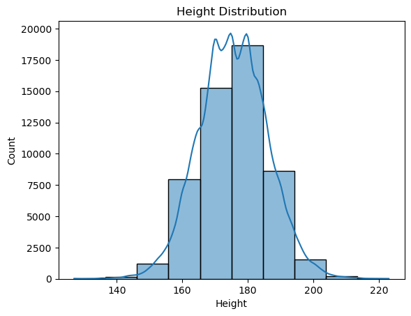
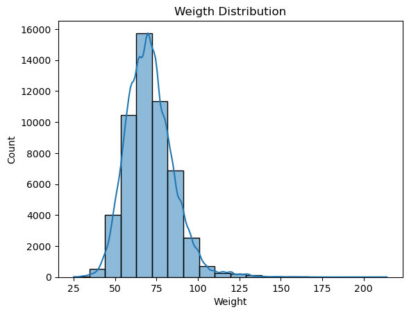
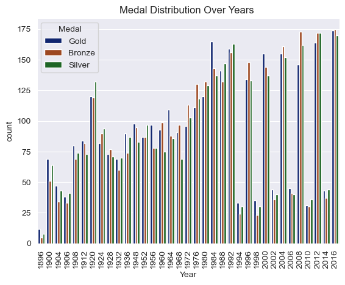
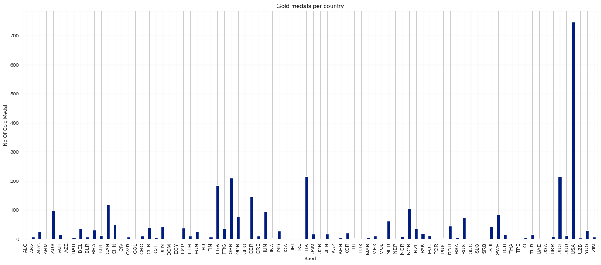
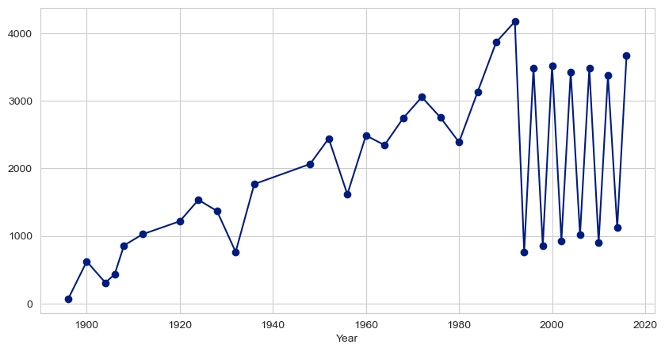
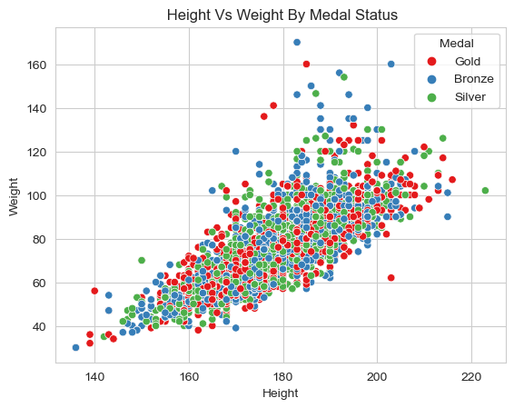

# Olympics Dataset EDA

This repository contains an exploratory data analysis (EDA) of the Olympics dataset. The dataset includes information about athletes, their physical characteristics, the sports they participated in, and the medals they won.

## Dataset

The dataset used in this analysis is `dataset_olympics.csv`, which contains the following columns:

- `ID`: Unique identifier for each athlete
- `Name`: Athlete's name
- `Sex`: Gender of the athlete
- `Age`: Age of the athlete
- `Height`: Height of the athlete (in cm)
- `Weight`: Weight of the athlete (in kg)
- `Team`: Team name
- `NOC`: National Olympic Committee 3-letter code
- `Games`: Year and season of the Olympics
- `Year`: Year of the Olympics
- `Season`: Season (Summer or Winter)
- `City`: Host city
- `Sport`: Sport name
- `Event`: Event name
- `Medal`: Medal won (Gold, Silver, Bronze)

## Analysis

The EDA includes the following steps:

1. **Loading the Dataset**: Reading the CSV file into a pandas DataFrame.
2. **Data Cleaning**: Handling missing values and duplicates.
3. **Descriptive Statistics**: Generating summary statistics for numerical and categorical features.
4. **Data Visualization**: Creating various plots to understand the distribution and relationships in the data.

## Visualizations

Here are some key visualizations included in the analysis:

- **Age Distribution**:
  

- **Height Distribution**:
  

- **Weight Distribution**:
  

- **Medal Distribution**:
  

- **Gold Medals per Country**:
  

- **participant_per_year**:
  

- **weight_vs_height_vs_medal**:
  

